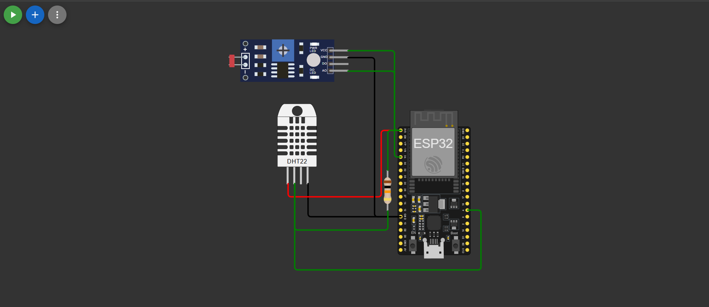
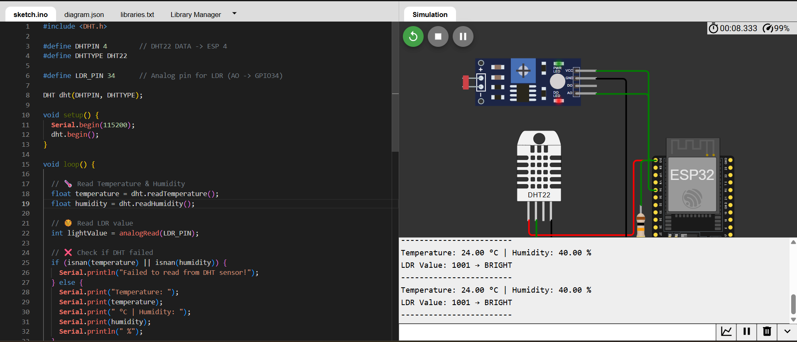

# 🌿 ESP32 Environmental Monitoring System

## 📌 Overview

This project is an ESP32-based environmental monitoring system that measures:

* Temperature 🌡️
* Humidity 💧
* Light intensity ☀️

The system uses sensors and displays real-time data on the Serial Monitor.

---

## 🛠️ Components Used

* ESP32
* DHT22 Sensor
* LDR Module
* Resistor (10kΩ)
* Wires

---

## ⚙️ Features

* Real-time temperature & humidity monitoring
* Light intensity detection (Bright/Dark)
* Serial output display
* Fully simulated using Wokwi

---

## 🔌 Circuit Diagram

---

## 📊 Output

---

## 💻 Code

Located in `/code/environmental_monitoring.ino`

---

## 🚀 Simulation

Wokwi Link: https://wokwi.com/projects/460563737605955585

---

## 📈 Applications

* Smart Homes
* Weather Monitoring
* Agriculture Systems

---

## 👩‍💻 Author

Amulya S Gupta
